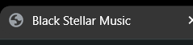
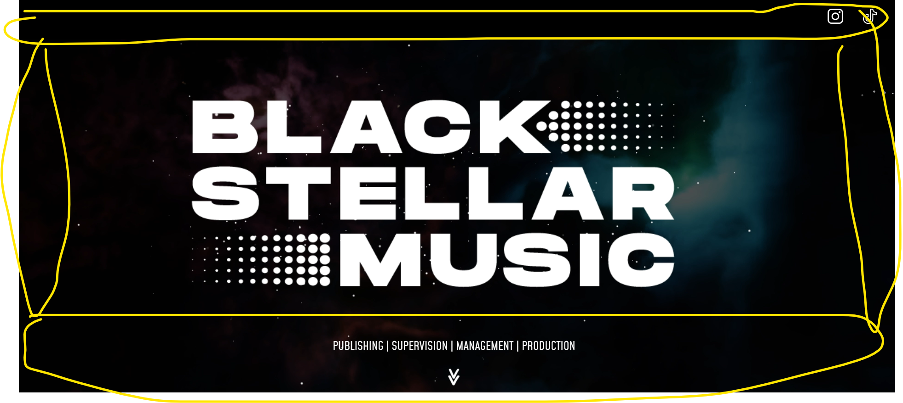
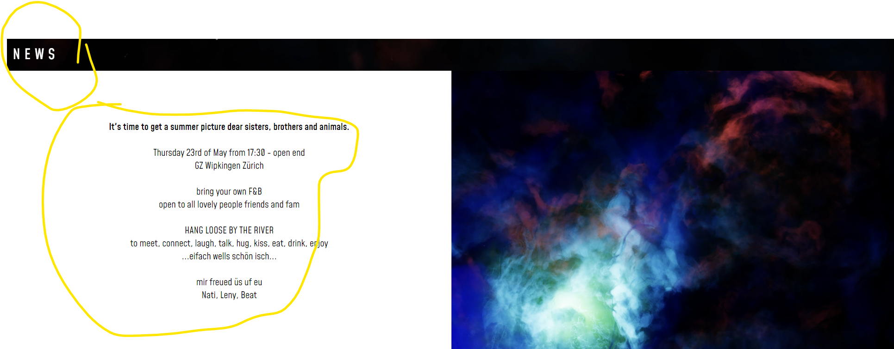
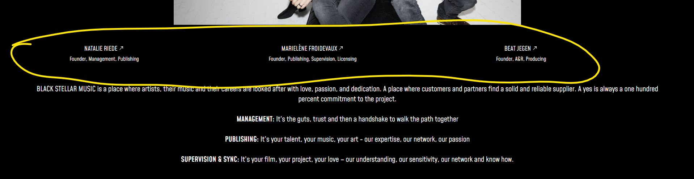
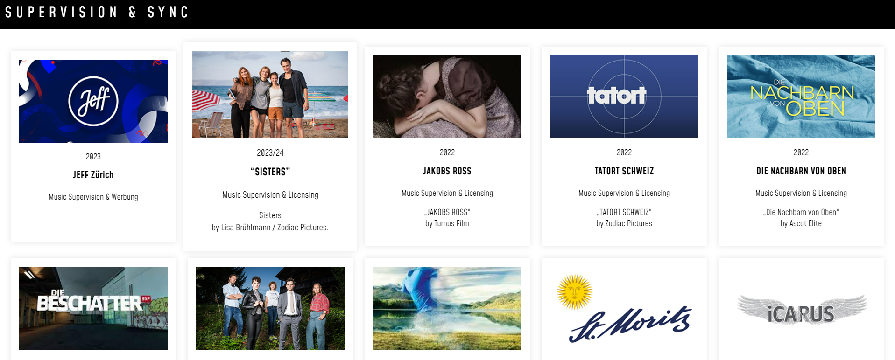
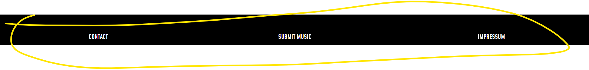
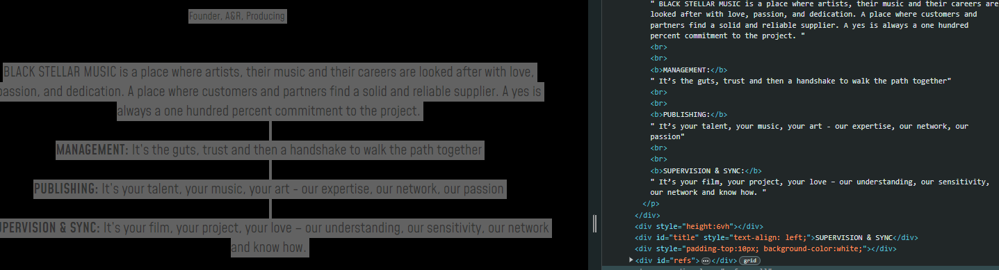

# BlackStellarMusicOverhaul

## 1. Favicon

Adding a favicon is essential for a more professional appearance and improves recognition in browser tabs.

## 2. Landing Page

The main issue here is the background video not being fullscreen, which affects the visual effects negatively. On mobile devices, the problem worsens due to the video being formatted in landscape orientation. Additionally, the logo is an image instead of an SVG, which would ensure consistent high-quality rendering (svgs are not like images with which you get a set amout of pixels. A svg calculates every stroke so it is always high quality).

## 3. News Section

The news section is almost acceptable, but there are two issues. Firstly, the header for this section and subsequent sections should ideally follow a consistent placement, perhaps aligning them all to the same side for improved readability. Secondly, when viewed on larger screens, the text becomes unreadably small while the layout of images remains unchanged. Addressing this issue may require further adjustments to ensure better readability.

## 4. About Us Section

A simple fix for this section would be setting the width to 100vw, ensuring it occupies the entire width of the screen. There might be a more optimal solution, but it's too complex to explain at the moment.

## 5. Supervision Section

Inconsistency arises in the scaling of images within this section. It's advisable to manage each individual section with viewWidth or maintain the current setup and adjust the elements at the top accordingly.

## 6. Footer Section

The footer appears minimalistic and lacking interest. Adding social media links or similar elements could enhance its appeal, though this is subjective and based on personal preference.

Please correct the grammar, and that's all, n
othing else, please.

# BlackStellarMusicOverhaul

## 1. FavIcon

Here you should add a fav icon so it doesn't look as unprofessional. A Fav icon is also kinda important for the tabs in your browser (easier reccognisable). 

## 2. Landing Page

The main problem here is that the video in the background is not fullscreen so it looks kinda bad with the effects. On mobile its even worse due to the fact that the video is formated in Landscape. The third problem here is that the Logo is a image and not a svg (svgs are not like images with which you get a set amout of pixels. A svg calculates every stroke so it is always high quality). 

## 3. News Section

This is almost okay there are just 2 problems. First of all is the Header for this Section and also for all following sections. I know that for artist websites is usual to strive away from the norm of a centered header but i suppose at least chosing the same side for each header would help a lot with readability. The second thing is when viewing the Site on a bigger screen. The text gets realy small and unreadable while the layout of images etc stays the same. I dont know right now how to fix that but you will figure it out. 

## 4. About us Section
 

This is a very easy fix with just w= 100vw (so it takes up the whole width of the screen). There is a better way but to difficult to explain right now.

## 5. Supervision Section

Here is a problem that the website becomes inconsistent on the scale of the images. I would recomment for the single sections here to be a. allso managed with viewWidth like the images above or keep it how it is and change the thingies at the top. 

## 6. Footer Section

This is just realy boring and minimalistic. I would recommend to add some social media links or something like that, but that is preference.

And please dont use the br tag. It is not good practice.

Your helping hand @DaniDevOfficial